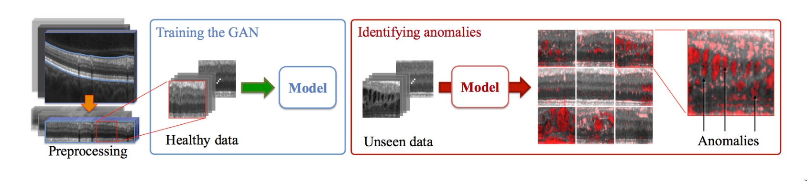
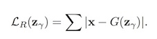
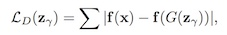
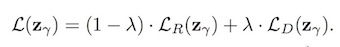
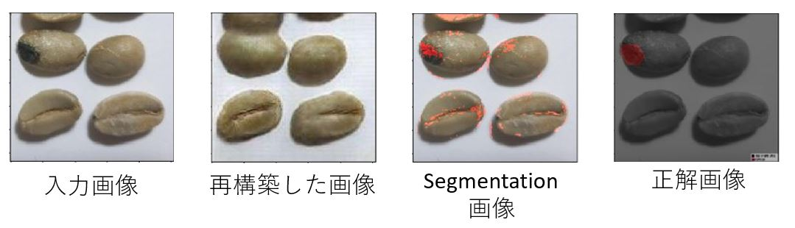

# cafe-picking-with-AnoGAN

AnoGANを用いて、コーヒー豆の異常検知を行った。
AnoGANについての論文: [Anomaly GAN (AnoGAN)](https://arxiv.org/abs/1703.05921).

## Model Description
まずDCGANを正常なデータのみ学習させる。そして、異常画像を入力し、学習したモデルの潜在空間に一番近い画像を生成するような潜在変数をマッピングする。ここでDCGANモデルは正常なデータだけ学習したので、異常画像に対して上手く再構成できない。よって、入力画像と生成した画像の違いを計算すれば異常検知ができるようになる。

ANOGANでは二つの画像の違いを計算するために異常度(Anomaly Score)を定義する 。この異常度は residual loss and discrimination lossから構成された。
- Residual loss: 二つの画像にある各ピクセルの差の合計。
- Discrimination loss: 入力画像と生成した画像の識別器の中間層の差を合計

異常度は二つのロスから以下の式で計算した。 (デフォルトは lambda = 0.1)

## Prerequisites (my environments)

- Python 2.7
- Tensorflow > 0.14
- SciPy
- pillow
- (Optional) [Align&Cropped Images.zip](http://mmlab.ie.cuhk.edu.hk/projects/CelebA.html) : Large-scale CelebFaces Dataset

## Usage
まずDCGANを訓練させる必要がある。

訓練済みのファイルはcheckpointに保存する。

### Model Preparation 
(If you want to download and train the model)
First, download dataset with:

    $ python download.py mnist celebA

To train a model with downloaded dataset:

    $ python main.py --dataset mnist --input_height=28 --output_height=28 --train
    $ python main.py --dataset celebA --input_height=108 --train --crop

Or, you can use your own dataset (without central crop) by:

    $ mkdir data/DATASET_NAME
    ... add images to data/DATASET_NAME ...
    $ python main.py --dataset DATASET_NAME --train
    $ python main.py --dataset DATASET_NAME
    $ # example
    $ python main.py --dataset=eyes --input_fname_pattern="*_cropped.png" --train

### Anomaly Detection
DCGANモデルを訓練した後,test_dataフォルダーにテストデータを入れて異常検出を行う.

    $ mkdir ./test_data
    ... add test images to ./test_data ...
    
    $ python main.py --dataset DATASET_NAME --input_height=108 --crop --anomaly_test
## Dataset
コーヒー豆のデータセット:[Cafe picking dataset](https://www.dropbox.com/sh/nnc555tftagmqlh/AAA5SieETk6me_8-17BBj_kSa?dl=0).

Dropboxフォルダの中以下の4種類がある。
- OK：正常な豆のみ入る画像データ。
- NG: 異常な豆と正常な豆を混ざった画像。
- NG/label_viz:異常画像に自分でアノテーションを付けた画像。
- NG/label:アノテーションを付けた箇所のみ強調した画像。

## Results
DCGANを学習させた後、異常画像を入力した時以下の結果を出た。ここでsegmentation画像はAnoGANにより異常検出した結果である。

## Related works
- [Image Style Transfer](https://pdfs.semanticscholar.org/7568/d13a82f7afa4be79f09c295940e48ec6db89.pdf)
- (Reconstruction-based AD) [Anomaly Detection in DBMSs](https://arxiv.org/abs/1708.02635)
- (ICLR2018 under-review) [ADGAN](https://openreview.net/forum?id=S1EfylZ0Z)

## Acknowledgement
- Thanks for @carpedm20 's implementation of [DCGAN](https://github.com/carpedm20/DCGAN-tensorflow)
- Thanks for @LeeDoYup 's implementation of [AnoGAN](https://github.com/LeeDoYup/AnoGAN-tf).
